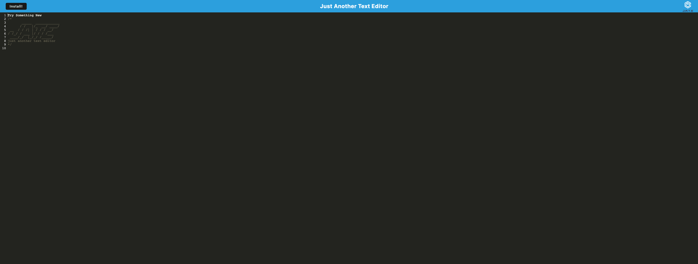
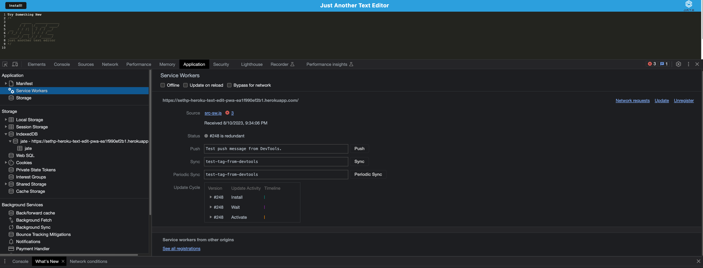
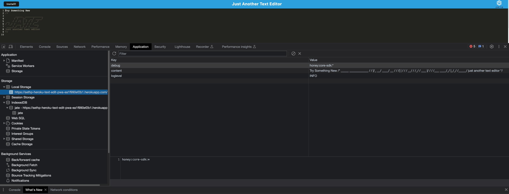
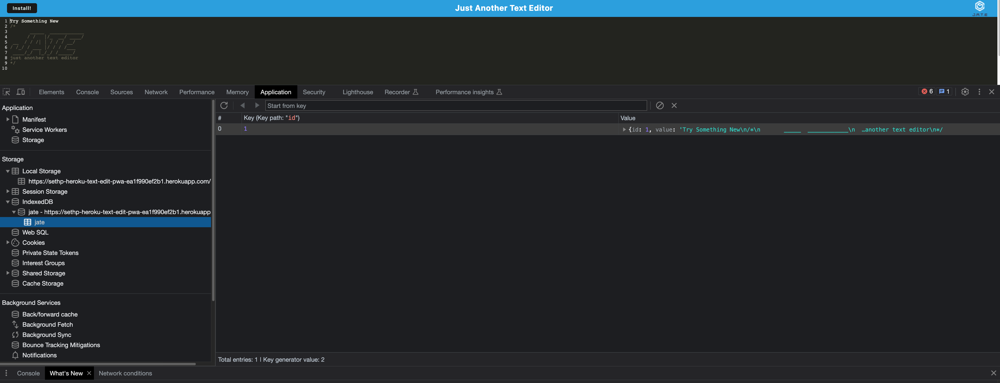

# Text Editor Description

In this assignment I needed to refactor code in order to create a text editor that runs in the browswer as a single-page application. After it was completed, it was deployed to Heroku. 

  ## Table of Contents

  * [Install](#install)
  * [Usage](#usage)
  * [Images](#images)
  * [Contributions](#contributions)
  * [Contact](#contact)

  ## Install

  Run npm i in the terminal to install the application.

  ## Usage

  Once in the of the folder, run 'npm run build'. Once the build is over, run 'npm run start'.

  ## Images

  

  

  
  
  

  ## Contributions

  Thank you to my TA and Tutor for assisting me in this project and getting it deployed to Heroku.

  ## Contact

 [Github Link](https://github.com/sethaphelps/PWA-Text-Editor)

 [Heroku Link](https://sethp-heroku-text-edit-pwa-ea1f990ef2b1.herokuapp.com/)